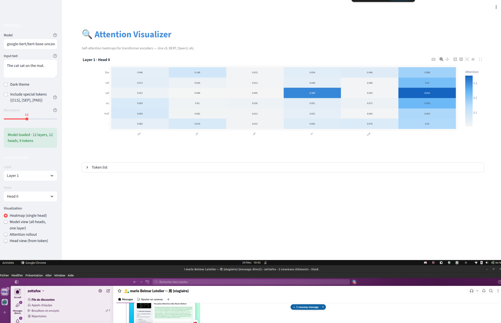

# Attention Visualizer

A **Streamlit** app to visualize **self-attention** in transformer encoder models (e.g. BERT, Jina v5, Qwen3). Heatmaps and multiple view styles help explore how attention is distributed over tokens.



## Features

- **Heatmap (single head)** — Token × token attention for one layer and one head.
- **Model view** — Grid of heatmaps for all heads in a selected layer.
- **Attention rollout** — Combined attention across layers (with residual connections).
- **Head view (from token)** — Bar chart of attention from one token to the others.
- **Special tokens** — Optional toggle to include or hide **[CLS]**, **[SEP]**, **[PAD]** (hidden by default, as they often act as attention sinks).
- **Light / dark theme** and a light, low-variation color palette for clarity.

## Requirements

- Python 3.9+
- See `requirements.txt` for dependencies.

## Installation

```bash
git clone <repo-url>
cd Attention-Vizualizer
pip install -r requirements.txt
```

## Run the app

```bash
streamlit run app.py
```

Then open the URL shown in the terminal (e.g. `http://localhost:8501`).

## Usage

1. **Model** — HuggingFace model id (default: `google-bert/bert-base-uncased`). Use any encoder that returns attention (e.g. `prajjwal1/bert-small`, `Qwen/Qwen3-0.6B-Base`).
2. **Input text** — Sentence or short text to run through the model.
3. **Include special tokens** — If checked, **[CLS]**, **[SEP]**, **[PAD]** appear in the heatmaps; if unchecked (default), they are hidden so content tokens are easier to read.
4. **Layer & head** — Choose which layer and head to visualize (single-head heatmap and head view).
5. **Visualization** — Switch between heatmap, model view, rollout, and head view.

The model is loaded once and cached for the session, so changing text or viz options does not reload the model.

## Project layout

- `app.py` — Streamlit UI and wiring.
- `model_service.py` — Cached model and tokenizer loading (singleton / `st.cache_resource`).
- `attention_utils.py` — Forward pass and attention helpers (raw, rollout).
- `viz_components.py` — Plotly heatmaps and charts.
- `requirements.txt` — Python dependencies.

## License

See repository license if applicable.
